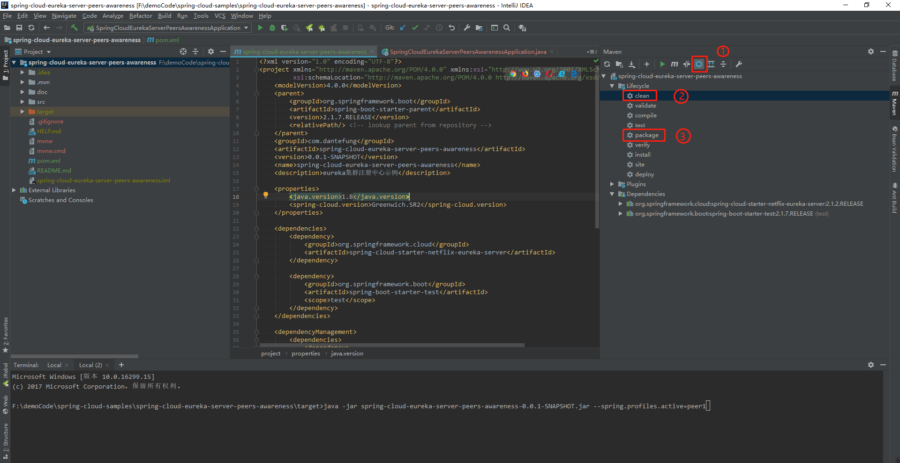
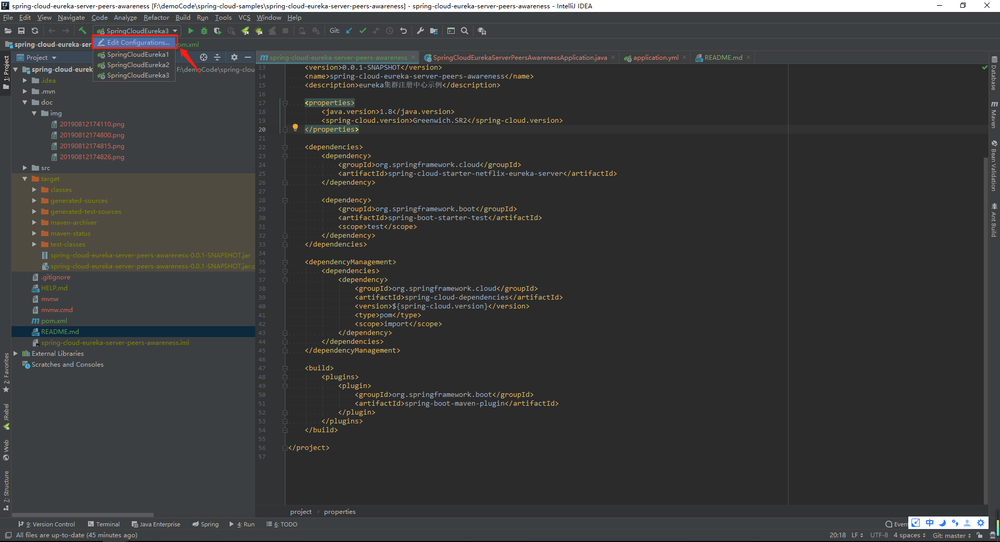
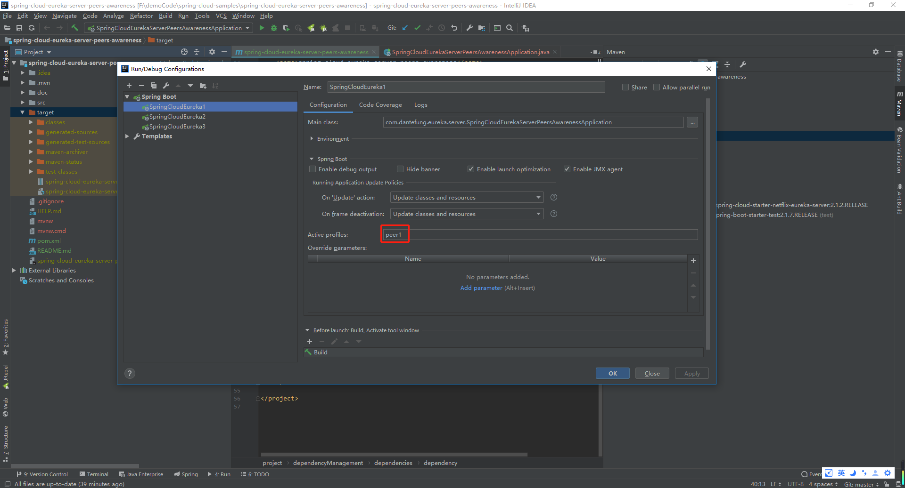
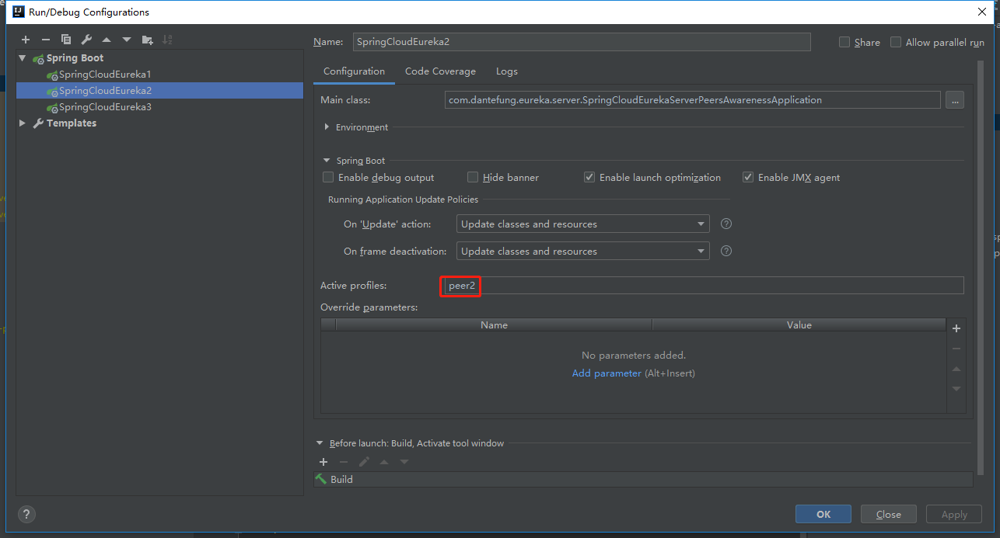
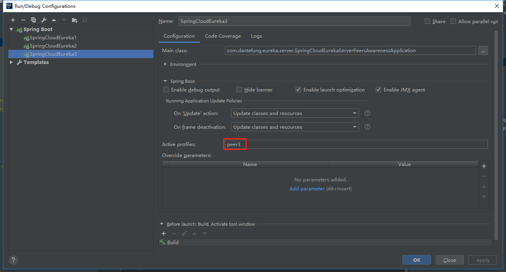
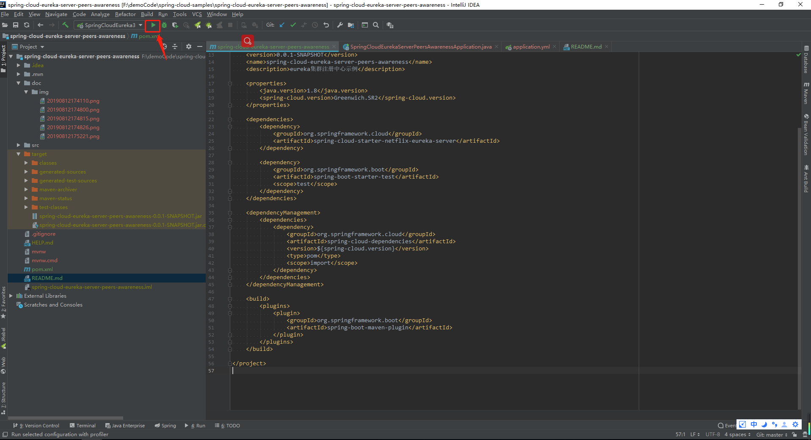

# 说明
本工程是注册中心Eureka的集群示例。

# 准备工作
windows环境下，修改C:\Windows\System32\drivers\etc下的host文件内容
linux环境下，修改/etc/hosts

加入以下内容:

```
127.0.0.1 peer1
127.0.0.1 peer2
127.0.0.1 peer3
```

# 如何运行本工程?

## 纯命令行

1.打开终端窗口，在项目的根目录下执行:

```
mvn clean package -DskipTests=true
```

2.打开三个终端窗口，分别进入 `你的盘符目录`/spring-cloud-samples/spring-cloud-eureka-server-peers-awareness/target/
下,分别执行
```
java -jar spring-cloud-eureka-server-peers-awareness-0.0.1-SNAPSHOT.jar --spring.profiles.active=peer1
java -jar spring-cloud-eureka-server-peers-awareness-0.0.1-SNAPSHOT.jar --spring.profiles.active=peer2
java -jar spring-cloud-eureka-server-peers-awareness-0.0.1-SNAPSHOT.jar --spring.profiles.active=peer3

```

## 在IDEA中运行
1. 先打包



2. 然后配置3个Spring Boot启动项,分别配置Active profiles为peer1,peer2,peer3.





3. 然后依次点击启动即可.


## 访问
http://peer1:8761/

http://peer2:8762/

http://peer3:8763/

## 参考文献
- [Service Discovery: Eureka Server](https://cloud.spring.io/spring-cloud-static/Greenwich.SR2/multi/multi_spring-cloud-eureka-server.html#netflix-eureka-server-starter)